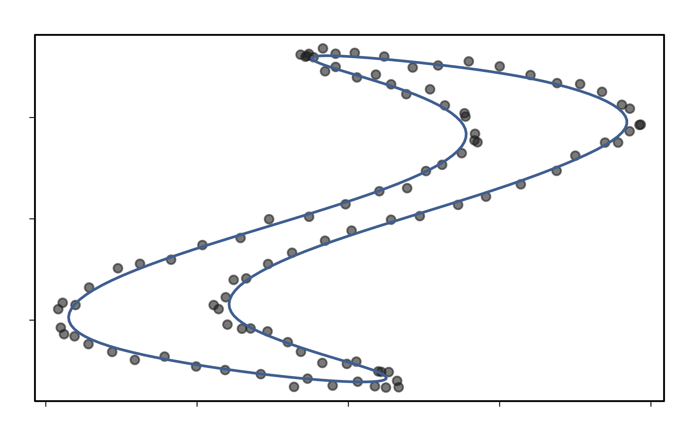

# Splinit
_Periodic spline regression and closed curve reconstruction._


## Example

Load the function.

```R
source("splinit.R")
```

Get a sample from a curve.

```R
curve <- function(u) {
  cbind(2*sin(u+1)*cos(2*u) + sin(u), cos(u)+cos(u-2.3))
}
pts = curve(2*pi*(1:100)/100) + rnorm(0, 0.02, n=200)
```

Spline it.

```R
plot(pts)
lines(splinit(pts))
```




